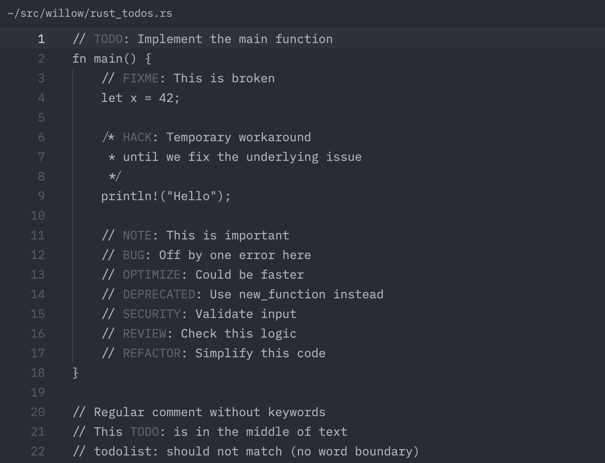
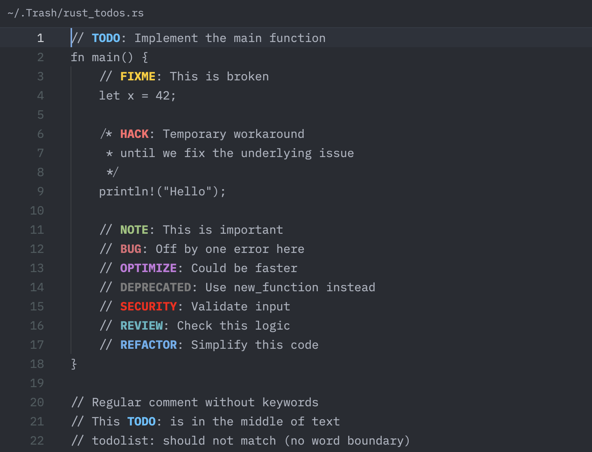

# Willow 🌿

**A graceful TODO/FIXME highlighter for Zed - bending with your workflow, never breaking**

Willow is a TODO/FIXME highlighting extension for the Zed editor that uses tree-sitter comment grammar injection to provide universal highlighting across all programming languages.

## Features ✨

- **Universal Language Support**: Works with 19+ languages out of the box
- **Zero Compilation**: Pure configuration-based extension - no build step required
- **Rich Pattern Recognition**: TODO, FIXME, HACK, NOTE, BUG, OPTIMIZE, SECURITY, and more
- **Theme Integration**: Works with your existing Zed theme or custom overrides
- **Lightweight**: No WebAssembly, no Rust compilation, just tree-sitter configuration

## Supported Keywords 🏷️

| Keyword | Description |
|---------|-------------|
| `TODO` | Tasks to be done |
| `FIXME` | Known issues to fix |
| `HACK` | Temporary workarounds |
| `NOTE` | Important information |
| `BUG` | Confirmed bugs |
| `OPTIMIZE` | Performance improvements |
| `SECURITY` | Security concerns |
| `DEPRECATED` | Obsolete code |
| `REVIEW` | Code review needed |
| `REFACTOR` | Refactoring needed |

Keywords are highlighted in comments using your theme's colors, distinct from regular comment text.



With custom theme overrides:



## Supported Languages 🌍

- Rust
- JavaScript/TypeScript
- Python
- Go
- C/C++
- Java
- Ruby
- Swift
- Kotlin
- PHP
- C#
- Elixir
- Haskell
- Shell (Bash)
- YAML
- TOML
- JSON5
- And easily extensible to more!

## Installation 📦

### From Zed Extension Gallery

1. Launch the Zed Extension Gallery:
   - Press `Cmd+Shift+X`
   - Or open the command palette and select "zed: extensions"
   - Or select "Zed > Extensions" from the menu bar

2. Search for "Willow" and click Install

### As a Dev Extension

1. Clone this repository:
   ```bash
   git clone https://github.com/willibrandon/willow.git
   ```

2. Open Zed Extension Gallery (`Cmd+Shift+X`)

3. Click "Install Dev Extension" and select the `willow` directory

## Customization 🎨

### Theme Colors

Add custom colors to your Zed `settings.json`:

```json
{
  "experimental.theme_overrides": {
    "syntax": {
      "comment.todo": { "color": "#4FC1FF", "font_weight": 700 },
      "comment.fixme": { "color": "#FFCC00", "font_weight": 700 },
      "comment.hack": { "color": "#FF6B6B", "font_weight": 700 },
      "comment.note": { "color": "#98C379", "font_weight": 700 },
      "comment.bug": { "color": "#E06C75", "font_weight": 700 },
      "comment.deprecated": { "color": "#7C7C7C", "font_weight": 700 },
      "comment.security": { "color": "#FF0000", "font_weight": 700 },
      "comment.optimize": { "color": "#C678DD", "font_weight": 700 },
      "comment.review": { "color": "#56B6C2", "font_weight": 700 },
      "comment.refactor": { "color": "#61AFEF", "font_weight": 700 }
    }
  }
}
```

### Adding Language Support

To add support for a new language, create a new injection configuration:

1. Create directory: `languages/{language}-injections/`
2. Add `config.toml`:
   ```toml
   name = "Language with TODOs"
   grammar = "language_grammar_name"
   path_suffixes = ["ext"]
   ```
3. Add `injections.scm`:
   ```scheme
   ((comment) @injection.content
    (#set! injection.language "comment"))
   ```
4. Update `extension.toml` to include the new language path

## Project Structure 📁

```
willow/
├── extension.toml           # Extension manifest
├── examples/               # Example files for all supported languages
├── languages/              # Language configurations
│   ├── comment/           # Core comment grammar highlighting
│   └── *-injections/      # Per-language injection rules
└── scripts/               # Helper scripts
    └── add-language-support.sh  # Add new language support
```

## How It Works 🔧

Willow leverages the [tree-sitter-comment](https://github.com/stsewd/tree-sitter-comment) grammar to parse comment content and highlight TODO patterns:

1. **Grammar Injection**: Each language's comment nodes are injected with the comment grammar
2. **Pattern Matching**: The comment grammar identifies TODO-style patterns
3. **Syntax Highlighting**: Zed applies theme colors to the identified patterns

No compilation, no WebAssembly, just pure tree-sitter configuration!

## Contributing 🤝

1. Fork the repository
2. Create a feature branch
3. Add language support or improve patterns
4. Submit a pull request

### Adding a New Pattern

Edit `languages/comment/highlights.scm` to add new patterns:

```scheme
((tag (name) @comment.yourpattern)
 (#any-of? @comment.yourpattern "YOURPATTERN" "yourpattern"))
```

## FAQ ❓

**Q: Why doesn't highlighting work in my language?**
A: Check if your language is in the supported list. If not, you can easily add it following the instructions above.

**Q: Can I change the highlight colors?**
A: Yes! Use the theme overrides in your Zed settings.json.

**Q: Does this slow down the editor?**
A: No, tree-sitter grammars are highly optimized and run at native speed.

## License 📄

MIT License - see [LICENSE](LICENSE) file.